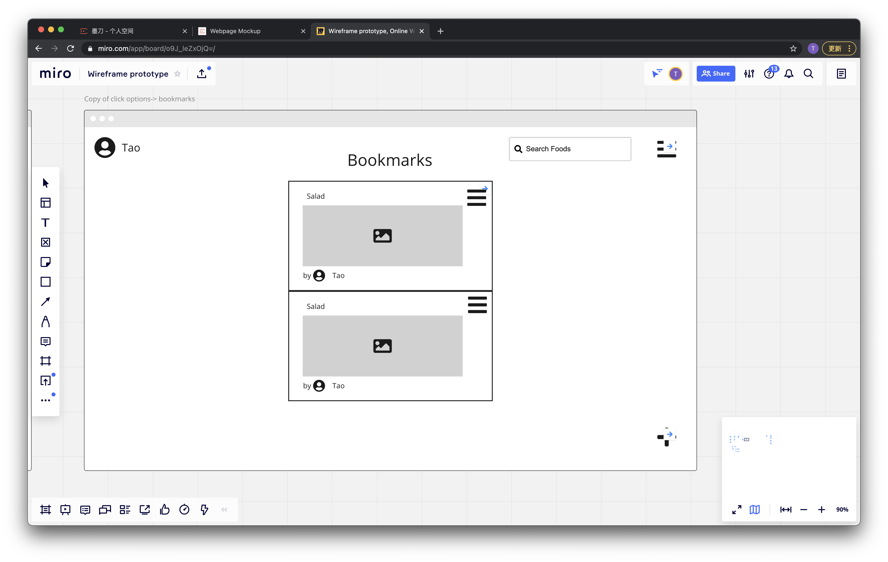
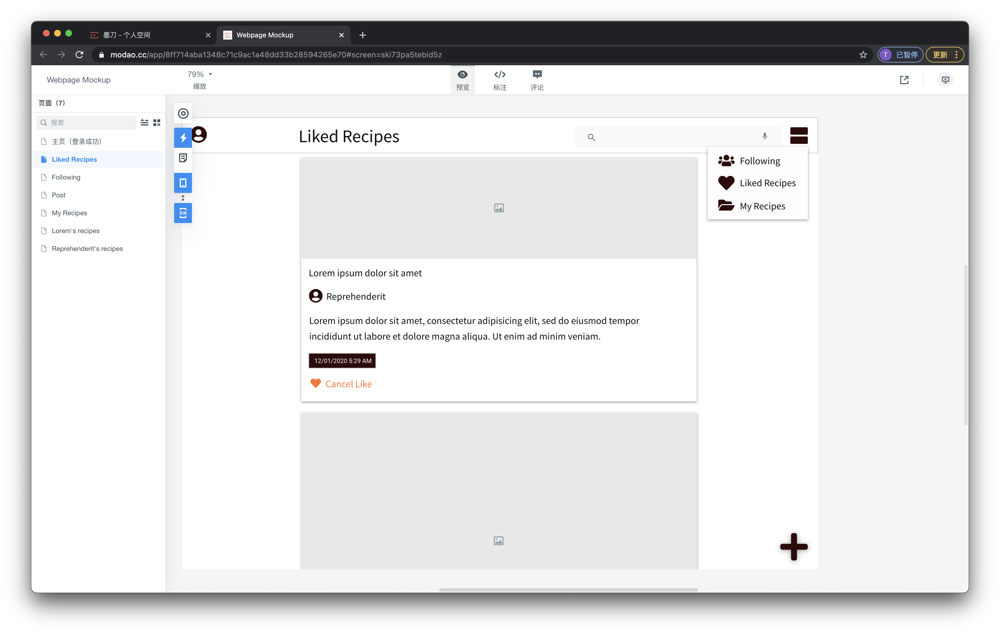

This webpage represents a course project of University of Delaware CISC682 Introduction to Human-Computer Interaction.

## About This Project

The main product of this project is a workable cook recipe sharing social network application, where users can share their recipes and tag them by categories. Shared recipes can be searched and viewed by other users.

This project is inspired by cook-at-home experience in COVID-19 pandemic. To avoid risk of virus spreading, cooking at home has become the major choice for meals. As self cooking becomes more frequent, the need of learning and sharing cook recipes is growing.

Main motivation and target of this project is to research on user interface design of social network application on both desktop and mobile platform. As there are many existing social network applications, we plan to use them as user interface samples and research on features of their designs.

## Team

### Jiaxing Yang

The team leader and programmer, implemented major part of programming and testing.

[Jiaxing Yang's Github Profile](https://github.com/jiaxingyatudel)

### Tao Xie

The designer and prototype sketcher, mainly studied social network software design principals, and designed prototype of this project.

[Tao Xie's Github Profile](https://github.com/ChristopherSTAN)

## Need Finding Process

### Survey

To research on needs of sharing and learning cooking recipes, a survey was made and posted on the Internet. The survey was distrubuted mainly to fellow students and close friend and family members. By this time (December 1, 2020), 12 responses are collected.

This [link](https://docs.google.com/forms/d/e/1FAIpQLSe6FNNFOBVXOURQfh4W6RaSL6ExfVbgYcQJPau--7qes3nZqw/viewform?usp=sf_link) directs to the online survey.

The responses indicate that learning cooking reciepes by social network is common among respondents. Almost all of them use one or more social network platforms, and more than half of them are learning cooking reciepes on them. However, the most popular form of cooking recipe sharing is videos on Youtube or other localized video sharing platforms rather than social networks based on text and photos. Also, very few of respondents who frequently cook for themselves are willing to share their recipes, which represents a potential challenge on the quantity and quality of the contents of the product.

This [link](./survey_findings.md) represents survey feedback statistics.

### Interview

Three fellow students were interviewed on potential needs of recipe sharing social networks. The interview went informally and unstructured. The finds of the survey was shared to in the interview, the interviewees agreed on the need of learning cooking recipes on social network, and the fact that the form of videos have advantages of presenting cooking contents compared to texts and photos. Possible solutions were brainstormed and disscussed, but none of them was found pratical or implementable. 

## Prototypes

### Wireframe and Mockup Prototypes

### Webpage Prototypes

Webpage prototypes are made to be interactable, by which test users can experience the user interface, and provide feedback on potential design flaws or problems if any difficulties occurred in test use sessions.

## Prototype Demonstration Video

[Link to Prototype Demonstration Video](https://youtu.be/S8fyJVCcpJE)

## Project Proposal and Presentation Slides

* [Link to proposal document](./cisc682_proposal.pdf)

* [Link to presentation slides](./cisc682_presentation.pdf)